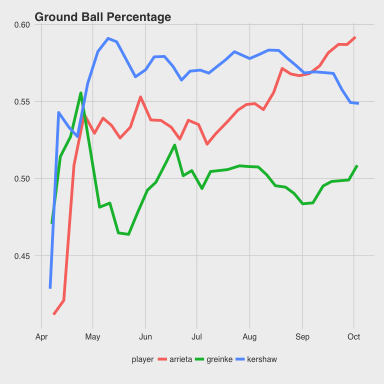
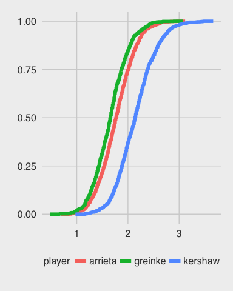

# Arrieta for Cy Young
Michael Griffiths  
November 19, 2015  

<style type="text/css">
  .section {overflow-x:scroll;}
</style>

This is an effort to duplicate Greg Reida's [iPython notebook on Cy Young](https://github.com/gjreda/cy-young-NL-2015/blob/master/cy-young.ipynb) in R, for kicks and giggles.

To begin, let's load the Hadley-verse.


```r
library(readr)
library(dplyr)
library(tidyr)
library(ggplot2)

# For quick plot styles
library(ggthemes)
# Set to FiveThirtyEight default
theme_set(theme_fivethirtyeight())

# To customize output for HTML.
library(knitr)
library(pander)
knit_print.data.frame = function(x, options){ pander(x) }
knit_print.list = function(x, options){ pander(x) }
knit_print.matrix = function(x, options){ pander(x) }
knit_print.table = function(x, options){ pander(x) }

panderOptions('table.style', "rmarkdown")
panderOptions('table.split.table', Inf)
panderOptions('table.split.cells', Inf)
panderOptions('table.alignment.default', 'left')
```

## Load game log files

First, let's load in some of the initial game files.


```r
# Convert date column to an actual date object. 
# Note that date comes in as either "Apr 11" or "Jul 12(1)"; we don't care about the brackets.
to_date <- function(datestring){
  date_no_brackets = gsub("\\(.+\\)", "", datestring)
  dates <- as.Date(sprintf("%s 2015", date_no_brackets), "%b %d %Y")
  return(dates)
}

# Convert innings to fraction.
# See @url(https://en.wikipedia.org/wiki/Innings_pitched)
innings_pitched <- function(ip){
  inning = floor(ip)
  partial_inning = ip %% 1
  return(inning + partial_inning / .3)
}

# Load three files into one dataframe, with a new column for the filename.
files = c("arrieta", "greinke", "kershaw")
data = list()
for(file in files){
  read_csv(sprintf("data/gamelogs/%s2015.csv", file)) %>%
    mutate(Date = to_date(Date), 
           player = file,
           IP = innings_pitched(IP)) ->
    data[[file]]
}
data = bind_rows(data)
head(data)
```


| Rk   | Gcar   | Gtm   | Date       | Tm   | [EMPTY]   | Opp   | Rslt   | Inngs   | Dec    | DR   | IP    | H   | R   | ER   | BB   | SO   | HR   | HBP   | ERA   | BF   | Pit   | Str   | StL   | StS   | GB   | FB   | LD   | PU   | Unk   | GSc   | IR   | IS   | SB   | CS   | PO   | AB   | 2B   | 3B   | IBB   | GDP   | SF   | ROE   | aLI   | WPA    | RE24   | DFS(DK)   | DFS(FD)   | Entered      | Exited           | player   |
|:-----|:-------|:------|:-----------|:-----|:----------|:------|:-------|:--------|:-------|:-----|:------|:----|:----|:-----|:-----|:-----|:-----|:------|:------|:-----|:------|:------|:------|:------|:-----|:-----|:-----|:-----|:------|:------|:-----|:-----|:-----|:-----|:-----|:-----|:-----|:-----|:------|:------|:-----|:------|:------|:-------|:-------|:----------|:----------|:-------------|:-----------------|:---------|
| 1    | 104    | 2     | 2015-04-08 | CHC  |           | STL   | W2-0   | GS-7    | W(1-0) | 99   | 7     | 3   | 0   | 0    | 3    | 7    | 0    | 0     | 0     | 27   | 104   | 65    | 20    | 4     | 7    | 10   | 3    | 2    | 0     | 75    | NA   | NA   | 0    | 0    | 0    | 24   | 1    | 0    | 0     | 0     | 0    | 0     | 1.13  | 0.428  | 3.23   | 30.15     | 15        | 1t start tie | 7t 3 out tie     | arrieta  |
| 2    | 105    | 7     | 2015-04-14 | CHC  |           | CIN   | L2-3   | GS-7    | L(1-1) | 5    | 6.667 | 7   | 3   | 3    | 1    | 5    | 0    | 0     | 1.98  | 27   | 110   | 73    | 20    | 7     | 9    | 12   | 5    | 2    | 0     | 52    | NA   | NA   | 1    | 0    | 0    | 26   | 2    | 0    | 0     | 0     | 0    | 0     | 0.75  | -0.105 | -0.08  | 10.6      | 8.67      | 1t start tie | 7t -2- 2 out  d3 | arrieta  |
| 3    | 106    | 12    | 2015-04-20 | CHC  | @         | PIT   | W5-2   | GS-7    | W(2-1) | 5    | 7     | 4   | 1   | 1    | 0    | 7    | 0    | 0     | 1.74  | 26   | 100   | 69    | 18    | 15    | 13   | 6    | 5    | 0    | 0     | 72    | NA   | NA   | 1    | 0    | 0    | 26   | 2    | 0    | 0     | 0     | 0    | 1     | 0.89  | 0.25   | 2.23   | 26.95     | 14        | 1b start tie | 7b 3 out  a3     | arrieta  |
| 4    | 107    | 17    | 2015-04-26 | CHC  | @         | CIN   | W5-2   | GS-6    | W(3-1) | 5    | 6     | 4   | 2   | 2    | 3    | 6    | 1    | 0     | 2.02  | 25   | 105   | 70    | 21    | 9     | 10   | 6    | 4    | 1    | 0     | 59    | NA   | NA   | 1    | 0    | 0    | 22   | 0    | 0    | 0     | 0     | 0    | 0     | 1.16  | 0.18   | 0.79   | 20.7      | 11        | 1b start tie | 6b 3 out  a3     | arrieta  |
| 5    | 108    | 22    | 2015-05-02 | CHC  |           | MIL   | L1-6   | GS-5    | L(3-2) | 5    | 5     | 7   | 4   | 4    | 1    | 6    | 1    | 0     | 2.84  | 22   | 90    | 62    | 12    | 8     | 6    | 9    | 5    | 1    | 0     | 42    | NA   | NA   | 3    | 1    | 0    | 20   | 0    | 0    | 0     | 0     | 0    | 0     | 0.55  | -0.239 | -1.7   | 6.85      | 7         | 1t start tie | 5t 3 out  d4     | arrieta  |
| 6    | 109    | 27    | 2015-05-07 | CHC  | @         | STL   | L1-5   | GS-6    | L(3-3) | 4    | 5.333 | 9   | 5   | 4    | 1    | 7    | 0    | 0     | 3.41  | 25   | 106   | 66    | 16    | 10    | 10   | 7    | 5    | 0    | 0     | 38    | NA   | NA   | 1    | 0    | 0    | 24   | 1    | 1    | 1     | 0     | 0    | 0     | 0.74  | -0.207 | -2.34  | 7.2       | 8.33      | 1b start tie | 6b 1-3 1 out  d4 | arrieta  |

## Calculate conversions

Now that we have the initial data loaded, let's calculate the summary statistics we want to look at on a per-player basis.


```r
addStatisticsColumns <- function(dataframe){
  dataframe %>%
  mutate(rollingIP = cumsum(IP),
         IPGame = rollingIP / Rk,
         rollingER = cumsum(ER),
         rollingERA = rollingER / rollingIP * 9,
         rollingSO = cumsum(SO),
         strikeoutsPerIP = rollingSO / rollingIP,
         `K/9` = rollingSO / rollingIP * 9,
         strikeoutsPerBF = rollingSO / cumsum(BF),
         hitsPerIP = cumsum(H) / rollingIP,
         hitsPerAB = cumsum(H) / cumsum(AB),
         rollingWHIP = (cumsum(H) + cumsum(BB)) / rollingIP,
         # Opponents against
         `1B` = H - `2B` - `3B` - HR,
         AVG = cumsum(H) / cumsum(AB),
         OBP = (cumsum(H) + cumsum(BB) + cumsum(HBP)) / (cumsum(AB) + cumsum(BB) + cumsum(HBP) + cumsum(SF)),
         SLG = (cumsum(`1B`) + 2*cumsum(`2B`) + 3*cumsum(`3B`) + 4*cumsum(HR)) / cumsum(AB),
         OPS = OBP / SLG,
         # Rates
         BABIP = (cumsum(H) - cumsum(HR)) / (cumsum(AB) + cumsum(SO) + cumsum(HR) + cumsum(SF)),
         `HR%` = cumsum(HR) / cumsum(BF),
         `XBH%` = (cumsum(`2B`) + cumsum(`3B`) + cumsum(HR)) / cumsum(BF),
         `K%` = cumsum(SO) / cumsum(BF),
         `IP%` = (cumsum(AB) - cumsum(SO) - cumsum(HR) + cumsum(SF)) / cumsum(BF),
         `GB%` = cumsum(GB) / (cumsum(AB) - cumsum(SO) - cumsum(HR) + cumsum(SF))
         ) %>%
    return
}

data %>%
  group_by(player) %>%
  arrange(Date) %>%
  addStatisticsColumns %>%
  ungroup ->
  data
```

Since we've calculated all of out statistics (and there are a lot of them!) let's move on to the fun part - **graphs**:


```r
data %>%
  ggplot(aes(x=Date, y=`GB%`, group=player)) +
  geom_line(aes(colour=player), size=2) +
  ggtitle("Games Behind Percentage")
```

 

We can see Arrieta continually improving, finally blasting past Kershaw.

## Arrieta's Second Half

Not sure what we do with this, but here how you do it - 


```r
allstarbreak = to_date('Jul 14')
data %>%
  filter(player == "arrieta", Date >= allstarbreak) %>%
  arrange(Date) %>%
  addStatisticsColumns ->
  arrieta2H
```

# Grid O' Stats

Now let's produce some more plots!

It's difficult to reproduce, exactly, the plot stlye in matplotlib. However, we can do an approximation of one of the rows very quickly:


```r
data %>%
  gather(vars, values, rollingERA, `K/9`, AVG, OBP, SLG) %>% 
  ggplot(aes(x=Date, group=player)) +
  geom_line(aes(y=values, colour=player), size=2) +
  facet_wrap(~vars, nrow=1, scales="free") 
```

 

Now let's do the same thing for more columns - 


```r
data %>%
  gather(vars, values, `IP%`, BABIP, `XBH%`, `HR%`, `K%`) %>% 
  ggplot(aes(x=Date, group=player)) +
  geom_line(aes(y=values, colour=player), size=2) +
  facet_wrap(~vars, nrow=1, scales="free") 
```

 

## Season Simulation

What if we replayed the season (sampling randomly from their performances)? Can we tell who is truly the ERA winner?


```r
calculateSeasonStats <- function(season) {
  season %>%
    summarise(
      ERA = sum(ER) / sum(IP) * 9,
      SO = sum(SO),
      H = sum(H),
      `2B` = sum(`2B`),
      `3B` = sum(`3B`),
      HR = sum(HR),
      BB = sum(BB),
      HBP = sum(HBP),
      SF = sum(SF),
      AVG = H / sum(AB),
      OBP = (H + BB + HBP) / (sum(AB) + BB + HBP + SF),
      SLG = (H + 2*`2B` + 3*`3B` + 4*HR) / sum(AB),
      AB = sum(AB),
      BF = sum(BF),
      Pit = sum(Pit),
      Str = sum(Str),
      StL = sum(StL),
      StS = sum(StS)
    ) %>%
    return
}

sampleSeasonWithReplacement <- function(season, runs=1000){
  results = list()
  for(sample_idx in 1:runs) {
    season %>% 
      # By default, sample is 100% of original size.
      sample_frac(replace=T) %>%
      calculateSeasonStats ->
      results[[sample_idx]] 
  }
  df = bind_rows(results)
  return(df)
}
```

Now that we have some helper functions to sample, we can just execute against each player - 


```r
data %>%
  group_by(player) %>%
  do(sampleSeasonWithReplacement(.)) %>%
  ungroup -> 
  simulation
```

That allows us to plot comparison histograms:


```r
simulation %>% 
  ggplot(aes(x=ERA)) + 
  geom_histogram() + 
  facet_grid(player ~ .) + 
  ggtitle("ERA by Player")
```

 

## Simulation Results

Now let's use some of the simulation results we have. 

We can take a look at the CDF, where you can see the same pattern as in the histograms but more clearly represented.


```r
simulation %>%
  ggplot(aes(x=round(ERA, 2))) +
  stat_ecdf(aes(colour=player), size=2)
```

 

We can also look at histograms for most of the statistics - 


```r
simulation %>%
  gather(vars, values, ERA, SO, AVG, OBP, SLG) %>%
  ggplot(aes(x=round(values, 2))) +
  geom_histogram(size=2) +
  facet_grid(player~vars, scales="free")
```

 

It's also interesting to look at the CDF for much the same view.


```r
simulation %>%
  gather(vars, values, ERA, SO, AVG, OBP, SLG) %>%
  ggplot(aes(x=round(values, 1))) +
  stat_ecdf(aes(colour=player), size=2) +
  facet_wrap(~vars, scales="free", nrow=1)
```

 

# Pitch f/x

## Load Pitch Data

Now let's take a look at pitching data.


```r
files = c("arrieta", "greinke", "kershaw")
pitch_data = list()
for(file in files){
  read_csv(sprintf("data/pitchfx/%s.csv", file)) %>%
    mutate(player = file) ->
    pitch_data[[file]]
}
pitch_data = bind_rows(pitch_data)
head(pitch_data, n=2)
```


| name         | player_id   | pitch_type   | pitch_result    | atbat_result   | start_speed   | z0    | x0     | pfx_x   | pfx_z   | px    | pz    | break_angle   | break_length   | spin_rate   | spin_dir   | zone   | balls   | strikes   | outs   | play                                                                                   | game_date   | inning   | inning_topbot   | tfs   | tfs_zulu   | catcher   | umpire   | umpire_name   | stolen_base_attempt   | stolen_base_success   | batted_ball_type   | [EMPTY]   | angle   | batted_ball_velocity   | direction   | hc_x   | hc_y   | pitch_id   | distance_feet   | player   |
|:-------------|:------------|:-------------|:----------------|:---------------|:--------------|:------|:-------|:--------|:--------|:------|:------|:--------------|:---------------|:------------|:-----------|:-------|:--------|:----------|:-------|:---------------------------------------------------------------------------------------|:------------|:---------|:----------------|:------|:-----------|:----------|:---------|:--------------|:----------------------|:----------------------|:-------------------|:----------|:--------|:-----------------------|:------------|:-------|:-------|:-----------|:----------------|:---------|
| Jake Arrieta | 453562      | SL           | In play, out(s) | Pop Out        | 90.2          | 6.294 | -2.992 | 5.78    | 0.77    | 0.238 | 2.296 | -19.8         | 7.5            | 1150.921    | 97.998     | 6      | 2       | 0         | 2      | Adam Lind pops out to third baseman Javier Baez in foul territory.                     | 2015-10-02  | 6        | bot             | 21030 | NA         | 471083    | 427019   | Ted Barrett   | 0                     | 0                     | PU                 | NA        | NA      | NA                     | NA          | 77.25  | 170.2  | 404        | NA              | arrieta  |
| Jake Arrieta | 453562      | CU           | In play, out(s) | Groundout      | 82.5          | 6.406 | -2.972 | 5.86    | -9.36   | 0.719 | 1.339 | -11.9         | 13.2           | 1919.844    | 32.187     | 14     | 1       | 2         | 2      | Khris Davis grounds out, second baseman Starlin Castro to first baseman Anthony Rizzo. | 2015-10-02  | 1        | bot             | 2815  | NA         | 471083    | 427019   | Ted Barrett   | 0                     | 0                     | GB                 | NA        | 0       | 67                     | NA          | 143.8  | 160.1  | 58         | 0               | arrieta  |

## Analyze Pitch Data

We can peek at pitch result - 


```r
pitch_data %>% 
  group_by(player, pitch_result) %>% 
  summarise(value=n()) %>% 
  spread(player, value)
```


| pitch_result              | arrieta   | greinke   | kershaw   |
|:--------------------------|:----------|:----------|:----------|
| Ball                      | 1148      | 1089      | 981       |
| Ball In Dirt              | 42        | 65        | 101       |
| Called Strike             | 605       | 522       | 559       |
| Foul                      | 612       | 513       | 615       |
| Foul (Runner Going)       | 9         | 9         | 10        |
| Foul Bunt                 | 15        | 14        | 10        |
| Foul Tip                  | 25        | 32        | 28        |
| Hit By Pitch              | 6         | 5         | 5         |
| In play, no out           | 128       | 124       | 128       |
| In play, out(s)           | 413       | 441       | 369       |
| In play, run(s)           | 39        | 33        | 45        |
| Intent Ball               | 8         | 2         | 2         |
| Missed Bunt               | 5         | 4         | 1         |
| Swinging Strike           | 352       | 351       | 465       |
| Swinging Strike (Blocked) | 31        | 35        | 73        |

... and at bat results.


```r
pitch_data %>% 
  group_by(player, atbat_result) %>% 
  summarise(value=n()) %>% 
  spread(player, value)
```


| atbat_result        | arrieta   | greinke   | kershaw   |
|:--------------------|:----------|:----------|:----------|
| Bunt Groundout      | 6         | 6         | 12        |
| Bunt Pop Out        | 1         | NA        | 4         |
| Double              | 106       | 83        | 90        |
| Double Play         | 12        | 4         | 2         |
| Fan interference    | NA        | 4         | NA        |
| Field Error         | 29        | 28        | 10        |
| Fielders Choice     | 5         | 3         | NA        |
| Fielders Choice Out | 16        | 1         | 1         |
| Flyout              | 245       | 317       | 200       |
| Forceout            | 66        | 31        | 65        |
| Grounded Into DP    | 52        | 51        | 18        |
| Groundout           | 710       | 687       | 583       |
| Hit By Pitch        | 15        | 12        | 21        |
| Home Run            | 23        | 51        | 53        |
| Intent Walk         | 8         | 4         | 4         |
| Lineout             | 197       | 250       | 175       |
| Pop Out             | 85        | 143       | 117       |
| Runner Out          | 6         | 12        | 16        |
| Sac Bunt            | 13        | 14        | 11        |
| Sac Fly             | 2         | 6         | NA        |
| Single              | 387       | 342       | 373       |
| Strikeout           | 1165      | 955       | 1390      |
| Strikeout - DP      | 7         | 6         | 8         |
| Triple              | 12        | 7         | 3         |
| Walk                | 270       | 222       | 236       |

We also want to add a few columns for strikes, etc.


```r
ball_vals = c('Ball', 'Ball In Dirt', 'Intent Ball', 'Hit By Pitch')
swing_and_miss = c('Swinging Strike', 'Swinging Strike (Blocked)', 'Missed Bunt')
hit_vals = c('Single', 'Double', 'Triple', 'Home Run')

# Add lookup table for at bat results -> bases equivalency.
at_bat_bases = data.frame(
  atbat_result=c("Single", "Double", "Triple", "Home Run"), 
  total_bases=1:4
)
  
pitch_data %>%
  left_join(at_bat_bases) %>%
  mutate(is_strike = ifelse(pitch_result %in% ball_vals, 0, 1),
         swing_and_miss = ifelse(pitch_result %in% swing_and_miss, 1, 0),
         is_hit = ifelse(pitch_result %in% hit_vals, 1, 0)
         ) ->
  pitch_data
```

```
## Joining by: "atbat_result"
```

```
## Warning in left_join_impl(x, y, by$x, by$y): joining factor and character
## vector, coercing into character vector
```

Now let's see who hits harder!


```r
pitch_data %>%
  ggplot(aes(x=batted_ball_velocity)) +
  geom_histogram(aes(fill=player)) +
  facet_grid(. ~ player)
```

 

Let's also take a look for a few summary statistics.


```r
pitch_data %>% 
  filter(batted_ball_type != "") %>%
  ggplot(aes(x=batted_ball_velocity)) +
  geom_histogram() +
  facet_grid(player ~ batted_ball_type, scales="free")
```

 

Now, what about their pitching speed? We can see the realized distributoin - 


```r
pitch_data %>% 
  filter(batted_ball_type != "") %>%
  ggplot(aes(x=batted_ball_velocity)) +
  geom_density(aes(fill=player, alpha=.2))
```

 

... but let's try to simulate the difference.


```r
set.seed(49)

simulatePitches = function(pitches, runs=1000){
  pitches %>%
    filter(!is.na(batted_ball_velocity)) %>%
    select(batted_ball_velocity) ->
    draws
  results = list()
  for(i in 1:runs){
    draws %>%
      sample_frac(replace=TRUE) %>%
      summarise(average_velocity = mean(batted_ball_velocity)) ->
      results[[i]]
  }
  results %>%
    bind_rows %>%
    return
}

# Run the simulation
pitch_data %>%
  group_by(player) %>%
  do(simulatePitches(.)) %>%
  ungroup ->
  pitches_simulated
head(pitches_simulated)
```


| player   | average_velocity   |
|:---------|:-------------------|
| arrieta  | 84.84              |
| arrieta  | 85.29              |
| arrieta  | 84.99              |
| arrieta  | 84.18              |
| arrieta  | 85.05              |
| arrieta  | 85.17              |

Now that we have some data on simulated pitches, let's take a look!


```r
pitches_simulated %>%
  ggplot(aes(x=average_velocity)) +
  geom_density(aes(fill=player, alpha=.3))
```

 

So, how do we know if they're significantly different?

The means for greinke and arrieta are certainly different - greinke is at ~88, whereas arrieta is at ~85.


```r
pitches_simulated %>%
  group_by(player) %>%
  summarise(velocity = mean(average_velocity))
```


| player   | velocity   |
|:---------|:-----------|
| arrieta  | 85         |
| greinke  | 88.35      |
| kershaw  | 84.9       |

We can also run a t-test


```r
v1 = pitches_simulated %>% filter(player=="arrieta") 
v2 = pitches_simulated %>% filter(player=="greinke")

# Run the test
t.test(v1$average_velocity, v2$average_velocity) ->
  t_arrieta_greinke
t_arrieta_greinke
```

```
## 
## 	Welch Two Sample t-test
## 
## data:  v1$average_velocity and v2$average_velocity
## t = -220.73, df = 1993.6, p-value < 2.2e-16
## alternative hypothesis: true difference in means is not equal to 0
## 95 percent confidence interval:
##  -3.383607 -3.324010
## sample estimates:
## mean of x mean of y 
##  84.99914  88.35295
```

We see there's a **very** low chance (p ~= 0) that these came from the same underlying distribution. So: Greinke gets hit "harder" than the other two players, for whatever reason - perhaps his pitches are easier to hit head on.

#### What is the relationship between batted ball velocity and batting average against these three?

To replicate - count the number of non-null balls hit back.


```r
pitch_data %>%
  filter(!is.na(batted_ball_velocity)) %>%
  group_by(player) %>%
  summarise(`# of pitches batted` = n())
```


| player   | # of pitches batted   |
|:---------|:----------------------|
| arrieta  | 1591                  |
| greinke  | 1598                  |
| kershaw  | 1291                  |

#### How difficult is each of their particular pitches to hit?


```r
pitch_data %>%
  group_by(player, pitch_type) %>%
  summarise(total = n()) %>%
  ungroup() %>%
  spread(player, total)
```


| pitch_type   | arrieta   | greinke   | kershaw   |
|:-------------|:----------|:----------|:----------|
|              | 5         | 3         | 8         |
| CH           | 145       | 599       | 18        |
| CU           | 531       | 293       | 616       |
| EP           | NA        | 2         | NA        |
| FA           | 13        | NA        | 2         |
| FF           | 524       | 1398      | 1823      |
| FT           | NA        | 321       | NA        |
| IN           | 6         | 2         | 1         |
| SI           | 1225      | NA        | NA        |
| SL           | 989       | 621       | 924       |

# Historical Cy Young Results

Now let's take a look at some historical results.


```r
# Load data file and convert share % to a number.
read_csv("data/cyyoung/results.csv") %>%
  mutate(share = as.numeric(gsub("%", "", share)) / 100) ->
  results
```


```r
results %>%
  group_by(year, league) %>%
  # Note that we're using dense_rank here, which does *not* allow for gaps, but *does* allow for ties.
  # This gives different results than the Python code.
  # We could replicate with row_number() to an extent, but we'd need to order by a third column to get consistent results,
  # In the situation of ties.
  mutate(era_rank = dense_rank(desc(earned_run_avg)),
         wins_rank = dense_rank(desc(W)),
         # Add "winner" flag
         winner = ifelse(rank == 1, 1, 0)
         ) %>%
  ungroup ->
  results
```

Note that, since the way we're calculating rank is different, we get different results from the iPython notebook - 


```r
results %>% 
  group_by(wins_rank) %>% 
  summarise(sum(winner))
```


| wins_rank   | sum(winner)   |
|:------------|:--------------|
| 1           | 67            |
| 2           | 21            |
| 3           | 8             |
| 4           | 4             |
| 5           | 5             |
| 6           | 2             |
| 7           | 1             |
| 8           | 0             |
| 9           | 0             |
| 10          | 0             |


```r
results %>%
  group_by(wins_rank, era_rank) %>%
  summarise(total=sum(winner)) %>%
  ungroup %>%
  spread(era_rank, total)
```


| wins_rank   | 1   | 2   | 3   | 4   | 5   | 6   | 7   | 8   | 9   | 10   | 11   | 12   |
|:------------|:----|:----|:----|:----|:----|:----|:----|:----|:----|:-----|:-----|:-----|
| 1           | 11  | 9   | 10  | 6   | 9   | 6   | 7   | 3   | 3   | 1    | 2    | NA   |
| 2           | 1   | 2   | 5   | 2   | 4   | 4   | 1   | 1   | 1   | 0    | NA   | NA   |
| 3           | 0   | 0   | 0   | 3   | 1   | 0   | 2   | 1   | 1   | NA   | 0    | NA   |
| 4           | 0   | 0   | 0   | 2   | 1   | 0   | 0   | 1   | 0   | 0    | NA   | NA   |
| 5           | 0   | 0   | 0   | 0   | 0   | 1   | 1   | 2   | 1   | 0    | NA   | NA   |
| 6           | 0   | 0   | 0   | 0   | 0   | 0   | 1   | 0   | 1   | 0    | 0    | NA   |
| 7           | NA  | NA  | 0   | 0   | 0   | 0   | 0   | 0   | 0   | 1    | 0    | NA   |
| 8           | NA  | 0   | NA  | 0   | NA  | 0   | NA  | 0   | 0   | 0    | 0    | NA   |
| 9           | NA  | NA  | NA  | NA  | NA  | NA  | 0   | 0   | 0   | 0    | 0    | NA   |
| 10          | NA  | NA  | NA  | NA  | NA  | NA  | NA  | NA  | NA  | NA   | NA   | 0    |
